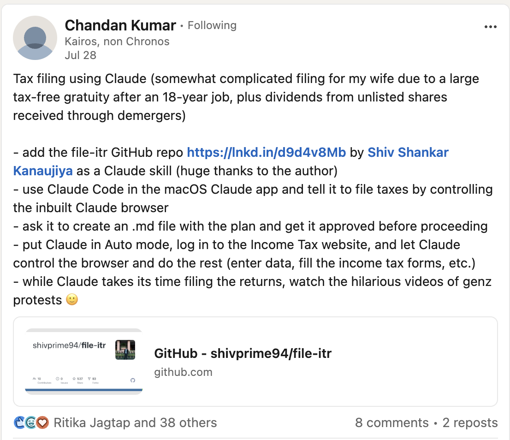

# file-itr

An agent **skill** that helps **any** Indian individual taxpayer prepare and
e-file an Income Tax Return (ITR-1/2/3/4) — under **either the old or the new
tax regime**.

[](LICENSE)
[](https://github.com/shivprime94/file-itr/actions/workflows/skill-bundle.yml)
[](https://github.com/shivprime94/file-itr/actions/workflows/engine-tests.yml)
[](https://github.com/shivprime94/file-itr/stargazers)

[Install](#install) · [Use](#use) · [What it covers](#what-it-covers) · [Scope](#scope-and-limitations) · [Repo structure](#repository-structure) · [Contributing](#contributing)

## What people say

<table>
  <tr>
    <td width="50%"></td>
    <td width="50%"></td>
  </tr>
  <tr>
    <td width="50%"></td>
    <td width="50%"></td>
  </tr>
</table>

<sub>Replies from [this X thread](https://x.com/neembu_paani31/status/2082884544185987480) and a LinkedIn post by Chandan Kumar, who filed a complicated return (large tax-free gratuity, dividends from demerged unlisted shares) with the skill.</sub>

## About

It reconciles salary + freelance/creator/business income + capital gains +
interest into a correct, fully-verified return, **compares both regimes and
proactively asks for the deduction proofs that lower tax legally**, fills the
portal schedule-by-schedule, fixes validation defects, and guides the user
through payment and e-verification.

Its aim is the **lowest legal tax** — claim every deduction the user genuinely
has and pick the cheaper regime — never to fabricate or inflate anything.

The skill lives in [`skills/itr-india/`](skills/itr-india/), distilled from a
real end-to-end ITR-3 filing (salaried + content-creator under 44ADA +
listed-share STCG + bank interest) and generalised to cover both regimes and
all common filer types.

> ⚠️ **Not professional tax advice.** This skill makes a return *accurate and
> defensible*, not minimised at any cost. Indian tax rules change every
> assessment year — always re-confirm current-year slabs, limits, and forms. The
> taxpayer remains responsible for the figures filed. The agent will never enter
> your password/OTP, make the payment, or submit/e-verify on your behalf — those
> are your actions by design.

## Install

### Claude Cowork (desktop)

1. Download `itr-india.skill` from this repo.
2. In Cowork, open the chat and use the **"Save skill"** button that appears when
   a `.skill` file is shared, **or** go to **Settings → Capabilities → Skills**
   and add it. (You can also drag the `.skill` file into the chat and click
   *Save skill*.)
3. The skill now appears in your skills list and triggers automatically when you
   talk about filing Indian taxes.

### Claude Code (CLI)

Skills live under a `skills/` directory that Claude Code reads. Either:

**A) Clone into your project's skills folder**
```bash
git clone https://github.com/shivprime94/file-itr.git
mkdir -p .claude/skills
cp -r file-itr/skills/itr-india .claude/skills/
```

**B) Install for all projects (user-level)**
```bash
git clone https://github.com/shivprime94/file-itr.git
mkdir -p ~/.claude/skills
cp -r file-itr/skills/itr-india ~/.claude/skills/
```

Restart Claude Code (or start a new session) and confirm with `/skills` (or
however your version lists skills). The skill triggers on ITR/tax-filing
requests.

Note: unlike the `.skill` bundle, `cp -r` also copies `engine/`, `evals/`, and
`conftest.py` — the skill doesn't load any of these, so it's harmless to have
them, but you don't need them for the skill to work.

### Any other Claude Agent SDK / custom agent

Place the `skills/itr-india/` folder wherever your agent loads skills from (the
directory containing per-skill folders, each with a `SKILL.md`). The agent reads
the YAML frontmatter `description` to decide when to trigger, and loads
`SKILL.md` + the `references/` files as needed.

## Use

Once installed, just talk to your agent naturally, e.g.:

- "Help me file my ITR for FY 2025-26 — I'm salaried and also do freelance
  content work, and I sold some shares this year."
- "I'm a YouTuber, new tax regime, can you do my income tax return in India?"
- "Reconcile my 26AS and AIS and tell me my total income and tax."
- "I'm stuck on a validation error on the income tax portal for my 44ADA return."
- "I traded crypto on an Indian exchange — made profit on some coins, lost on
  others, 1% TDS was deducted. How is it taxed and which ITR form?"
- "My father is 67, gets pension + FD interest, paid health insurance — old or new
  regime, and how much tax?"
- "I have 80C, a home loan and HRA — is the old or new regime cheaper for me?"

The agent will gather your documents, reconcile income, compute tax, walk the
portal with you, and stop at the payment/submit/e-verify steps for you to
complete.

### What you'll need to provide

Form 16(s), Form 26AS, AIS/TIS, bank statements for the financial year, any
broker/capital-gains statement, and any platform payout files (Stripe/YouTube/
X/etc.). For the portal steps, you log in yourself and the agent drives the form.

## What it covers

- Picking the right form (ITR-1/2/3/4) and **comparing old vs new regime**
  (115BAC / Form 10-IEA) on the user's real numbers to choose the cheaper one.
- **Old-regime deduction catalogue** (80C, 80D, 80CCD/NPS, HRA, home-loan
  interest, 80G, 80E, 80TTA/TTB, …) and a **proactive checklist of documents to
  ask for** so no legitimate deduction is missed.
- Reconciling income to source documents (Form 16, 26AS, AIS, bank statements,
  platform payout files) — one number per head, each tied to a document.
- Presumptive taxation for creators/freelancers/small business (44AD/44ADA,
  CBDT code 16021).
- Capital gains on listed equity/MF/property (111A/112A special rates,
  quarterly breakup for 234C), virtual digital assets/crypto (115BBH), and
  interest/dividends in Schedule OS.
- Independent tax computation (both regimes) to verify the portal's math —
  backed by a separately tested rule engine (see
  [Repository structure](#repository-structure) below).
- Driving the e-filing portal, with workarounds for its known quirks
  (logout pop-ups, mat-select dropdowns, the trailing-zero bug, silent
  schedule un-confirmation, and the no-account balance-sheet validation defect).
- Handing off payment, submission, and e-verification cleanly.

## Scope and limitations

- **The verified engine** (`skills/itr-india/engine/`) is scoped to AY 2026-27,
  resident individuals, both regimes, and structurally refuses — fail-loud, not
  a guess — non-residents, business/house-property/foreign income, Chapter
  VI-A deductions beyond what's modeled, AMT, clubbing provisions, and Section
  89 relief. See [`engine/README.md`](skills/itr-india/engine/README.md) for
  the exact boundary.
- **The skill's reference material** (`skills/itr-india/references/`) covers
  domestic salary/freelance/business income, capital gains, deductions, and
  VDA/crypto in depth. It recognises RNOR/non-resident status and foreign
  assets/income as real scenarios — they're documented ITR-4 disqualifiers
  that route to ITR-2/3 — but there's no dedicated Schedule FA/FSI/TR
  reference yet, so that coverage is thinner than the domestic-filer material
  and should be verified independently or with a CA.
- **India personal income tax only** — not GST, TDS returns (24Q/26Q), or
  company/firm returns.
- Complex F&O/intraday trading, tax-audit applicability, and multi-year
  brought-forward-loss continuity should be verified with a CA — the skill
  helps reconcile and file, it doesn't replace judgment on edge cases.

## Repository structure

- [`skills/itr-india/`](skills/itr-india/) — the skill itself. Start with
  `SKILL.md` (workflow + judgment), then `references/` for regime, deduction,
  presumptive-taxation, capital-gains/VDA, and portal-workflow detail. This is
  what ships inside `itr-india.skill`.
- [`skills/itr-india/engine/`](skills/itr-india/engine/) — a separate, tested
  Python engine (scope check → bucketing → set-off → rates → interest) that
  independently recomputes the tax to audit the skill's numbers. It is **not**
  part of the installable bundle. See its own
  [README](skills/itr-india/engine/README.md), and run its tests with
  `pytest skills/itr-india/engine/tests -v`.
- [`itr-india.skill`](itr-india.skill) — the zipped, one-click-install bundle.
  CI rebuilds it deterministically whenever `SKILL.md`, `references/`, or
  `evals/` change — never hand-edit it.
- [`scripts/`](scripts/) — bundle build tooling.
- [`.github/workflows/`](.github/workflows/) — CI.

## Contributing

Bug reports, corrected reference material, and engine improvements are
welcome. See [CONTRIBUTING.md](CONTRIBUTING.md) for dev setup, running the
test suite, and commit/PR conventions.

## License

MIT — see [LICENSE](LICENSE).

## Disclaimer

This project is provided "as is", without warranty of any kind. It is not a
substitute for a chartered accountant or a registered tax practitioner. Verify
every figure before filing. The authors are not liable for any filing made using
this skill.
